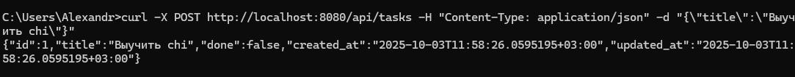
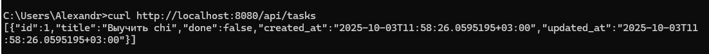
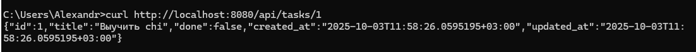
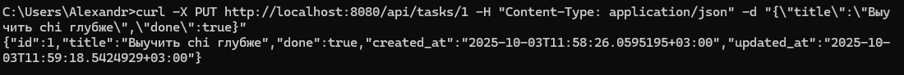

## практическа работа 4

### ЭФМО-02-25 Фомичев Александр Сергеевич

#### Структура проекта
```
pz4-todo/
  go.mod
  main.go
  internal/
    task/
      model.go
      repo.go
      handler.go
  pkg/
    middleware/
      logger.go
      cors.go
```

## Проверка CRUD через curl/Postman


**работа сервера**


**Создание**



**Список**



**Получение по id**



**Обновить**



**удаление**


